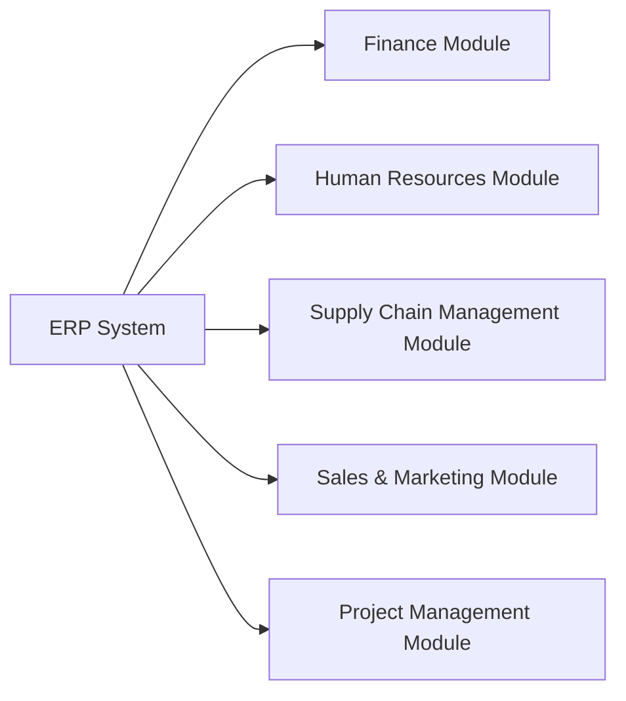

# Jockes Dream ERP

## Overview
Jockes Dream ERP is an all-encompassing enterprise resource planning system aimed at streamlining business operations through a series of integrated modules.

## Modules
- **Finance**: Financial management tools including payroll and invoicing.
- **Human Resources**: Employee management and benefits processing.
- **Supply Chain Management**: Inventory control and logistics.
- **Sales & Marketing**: CRM and sales forecasting capabilities.
- **Project Management**: Task scheduling and resource allocation.

## User Interface
- Customizable dashboards for real-time data insights.
- Mobile-ready interface for accessibility on any device.

## Technology Stack
- **Backend**: Java/Python
- **Frontend**: React/Vue.js

## Security
- Role-based access control.
- Data encryption and secure API connections.

## Diagrams

(Note: The diagram is a conceptual representation)
