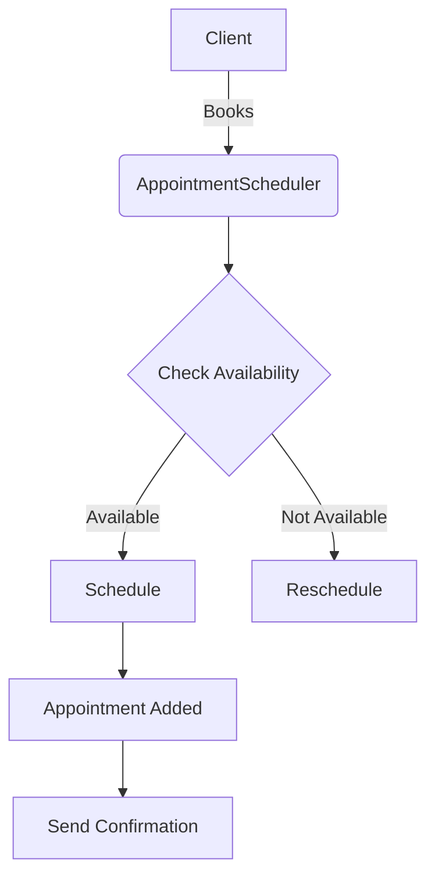

# Appointment Management Module

## Overview
The Appointment Management Module is designed to streamline the scheduling, tracking, and management of client appointments in a barber shop. It facilitates efficient appointment handling to enhance customer service and optimize operational flow.

## Classes and Dependencies
- **Appointment**: Represents an appointment with attributes like client, barber, service, start time, and duration.
- **AppointmentScheduler**: Manages the scheduling of appointments, checking for conflicts and availability.
- **NotificationService**: Sends reminders and notifications to clients about upcoming appointments.

## Code Example

```python
class Appointment:
    def __init__(self, client, barber, service, start_time, duration):
        self.client = client
        self.barber = barber
        self.service = service
        self.start_time = start_time
        self.duration = duration

class AppointmentScheduler:
    def __init__(self):
        self.appointments = []

    def schedule_appointment(self, appointment):
        if self.is_available(appointment):
            self.appointments.append(appointment)
            return True
        return False

    def is_available(self, appointment):
        # Check for time conflicts with existing appointments
        return all(
            (appointment.start_time >= a.start_time + a.duration) or
            (appointment.start_time + appointment.duration <= a.start_time)
            for a in self.appointments
        )

class NotificationService:
    def send_reminder(self, appointment):
        # Logic to send notification/reminder
        pass
```

## Mermaid Diagram



## Gherkin Syntax

```gherkin
Feature: Appointment Management
  To schedule barber appointments efficiently
  As a barber shop
  I want to manage client bookings and availability

  Scenario: Successfully book a new appointment
    Given a client's requested time is available
    When the appointment is scheduled
    Then the appointment is added to the system
    And the client receives a confirmation notification

  Scenario: Fail to book an appointment due to a conflict
    Given a client's requested time conflicts with another appointment
    When the appointment scheduling is attempted
    Then the system does not schedule it
    And the client is prompted to choose a different time
```

This module, with its integrated classes and functionalities, helps execute streamlined appointment management for barbers.